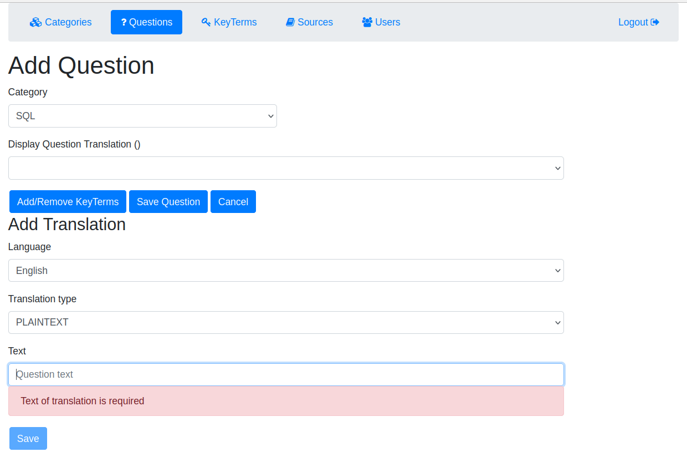

# knowthenix-kbd

Многоязычный сервис представления знаний в виде пары Вопрос-Ответ c возможностью
параллельного или избирательного представления одной и той же технической информации на разных языках.
Один Вопрос может иметь множество разных Ответов с указанием Источников.
Каждый вопрос или ответ может быть представлен переводами на нескольких языках.

Один из вариантов применения это использование внутри организации, где один пользователь может найти
в сети или других источниках необходимую информацию на одном языке, добавить ее в систему, а другие пользователи
могут ее дополнить переводами для расширения доступности.

Другой из вариантов применения - индивидуально в учебных целях.

## Визуальная схема фронтенда

## Документация

1. Маркетинг
   1. [Заинтересанты](docs/marketing/01-stakeholders.md)
   2. [Целевая аудитория](docs/marketing/02-target-audience.md)
   3. [Конкурентный анализ](docs/marketing/03-сompetitive-analysis.md)
   4. [Анализ экономики](docs/marketing/04-economic-analysis.md)
   5. [Пользовательские истории](docs/marketing/05-user-stories.md)
2. DevOps
   1. [Схема инфраструктуры](docs/devops/01-infrastruture.md)
   2. [Схема мониторинга](docs/devops/02-monitoring.md)
3. Тесты
4. Архитектура
   1. [Компонентная схема](docs/architecture/01-arch.md)
   2. [Интеграционная схема](docs/architecture/02-integration.md)
   3. [Описание API](docs/architecture/03-api.md)

# Структура проекта

## Транспортные модели, API

1. [specs](specs) - описание API в форме OpenAPI-спецификаций
2. [translation-api-v1-jackson](translation-api-v1-jackson) - генерация 1-й версии транспортных моделей с Jackson
3. [translation-api-v2-kmp](translation-api-v2-kmp) - генерация 2-й версии транспортных моделей с Kotlin Multiplatform
4. [translation-common](translation-common) - общие классы для модулей проекта, содержит внутренние модели и контекст
5. [translation-mappers-v1](translation-mappers-v1) - мапперы между внутренними моделями и моделями API v1
6. [translation-mappers-v2](translation-mappers-v2) - мапперы между внутренними моделями и моделями API v2
