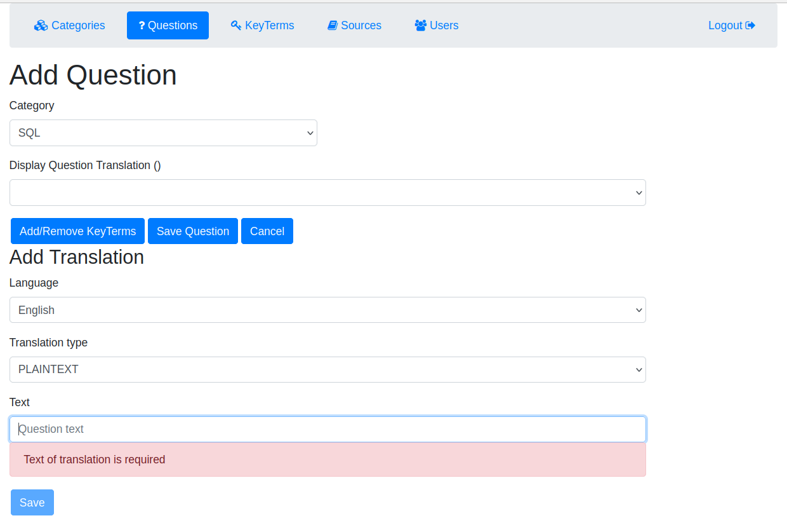

# knowthenix-kbd

Knowthenix - сервис представления знаний в виде пары Вопрос-Ответ c возможностью
параллельного представления одной и той же информации на разных национальных языках.
Сервис дает возможность формулировать вопросы и находить на них ответы без привязки к определенному национальному языку,
а также формировать базу знаний на целевом языке используя источники созданные на других языках.

## MVP

Web приложение предоставляет пользователю минимальные возможности:
* Создание первичного перевода вопроса
* Добавление перевода к существующему первичному переводу
* Редактирование перевода вопроса
* Чтение переводов 
* Поиск перевода по заданному фильтру
* Удаление перевода

## Визуальная схема фронтенда

## Документация

* Маркетинг и аналатика
  * [Целевая аудитория](docs/biz/01-target-audience.md)
  * [Пользовательские истории](docs/biz/02-bizreq.md)
* DevOps
  * [Файлы сборки](./deploy)
* Архитектура
  * [Описание API](docs/architecture/api.md)
  * [Упрощенная компонентная схема](docs/architecture/arch.md)

## Структура проекта

### Плагины

#### Плагины Gradle сборки проекта

1. [build-plugin](build-plugin) Модуль с плагинами
2. [BuildPluginJvm](build-plugin/src/main/kotlin/BuildPluginJvm.kt) Плагин для сборки проектов JVM
3. [BuildPluginMultiplarform](build-plugin/src/main/kotlin/BuildPluginMultiplatform.kt) Плагин для сборки
   мультиплатформенных проектов

### Проектные модули

#### Транспортные модели, API

1. [specs](specs) - описание API в форме OpenAPI-спецификаций
2. [knowthenix-api-v1-jackson](knowthenix-be/knowthenix-api-v1-jackson) - 1-я версия транспортных модели с Jackson
3. [knowthenix-api-v1-mappers](knowthenix-be/knowthenix-api-v1-mappers) - Мапперы из API v1 во внутренние модели
4. [knowthenix-api-v2-kmp](knowthenix-be/knowthenix-api-v2-kmp) - 2-я версия транспортных моделей с KMP
5. [knowthenix-common](knowthenix-be/knowthenix-common) - модуль с общими классами для всех модулей проекта.
   Содержит внутренние модели и контекст.
6. [knowthenix-mappers-log1](knowthenix-be/knowthenix-api-log1) - Модели логирования первой версии и маппер между
   внутренними моделями и моделями логирования.

#### Фреймворки и транспорты
1. [knowthenix-app-spring](knowthenix-be/knowthenix-app-spring) - Приложение Spring.
2. [knowthenix-app-ktor-kmp](knowthenix-be/knowthenix-app-ktor-kmp) - Приложение Ktor на KMP (отключено в settings.gradle.kts).
3. [knowthenix-app-ktor-jvm](knowthenix-be/knowthenix-app-ktor-jvm) - Приложение Ktor на JVM, 
   также содержит endpoint на websocket.
4. [knowthenix-app-kafka](knowthenix-be/knowthenix-app-kafka) - Микросервис на Kafka.

#### Модули бизнес-логики
1. [knowthenix-stubs](knowthenix-be/knowthenix-stubs) - Стабы для ответов сервиса.
2. [knowthenix-lib-cor](knowthenix-libs/knowthenix-lib-cor) - Библиотека CoR (Chain of Responsibility) для бизнес-логики.
3. [knowthenix-biz](knowthenix-be/knowthenix-biz) - Модуль бизнес-логики приложения: обслуживание стабов, валидация, работа с БД.

#### Хранение, репозитории, базы данных
1. [knowthenix-repo-tests](knowthenix-be/knowthenix-repo-tests) - Базовые тесты для репозиториев всех баз данных.
2. [knowthenix-repo-common](knowthenix-be/knowthenix-repo-common) - Модуль с общими классами для всех репозиториев.
3. [knowthenix-repo-inmemory](knowthenix-be/knowthenix-repo-inmemory) - Репозиторий на базе кэша in-memory для тестирования.
4. [knowthenix-repo-postgres](knowthenix-be/knowthenix-repo-postgres) - Репозиторий на PostgreSQL.

#### Аутентификация, авторизация
1. [knowthenix-auth](knowthenix-be/knowthenix-auth)

### Библиотеки

#### Мониторинг и логирование

1. [deploy](deploy) - Инструменты мониторинга и деплоя
2. [knowthenix-lib-logging-common](knowthenix-libs/knowthenix-lib-logging-common) - Общие объявления для логирования
3. [knowthenix-lib-logging-kermit](knowthenix-libs/knowthenix-lib-logging-kermit) - Логирование на базе Kermit
4. [knowthenix-lib-logging-logback](knowthenix-libs/knowthenix-lib-logging-logback) - Логирование на базе Logback
5. [knowthenix-lib-logging-socket](knowthenix-libs/knowthenix-lib-logging-socket) - Логирование на базе протокола TCP socket

### Тестирование

#### Сквозные/интеграционные тесты

1. [knowthenix-e2e-be](knowthenix-tests/knowthenix-e2e-be) - Сквозные/интеграционные тесты для бэкенда
