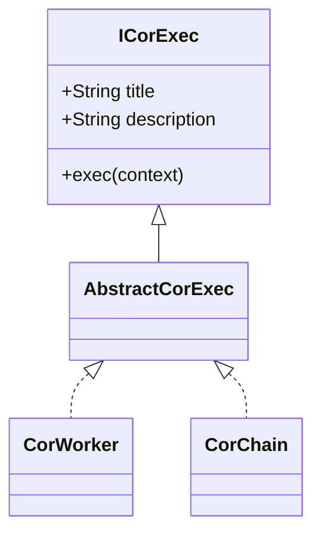

# lib-cor

Библиотека реализующая управляющий шаблон разработки CoR - Chain or Responsibility.

Главные термины:
1. **Context** - это dto для хранения всех возможных состояний текущего бизнес-процесса. 
   Экземпляр этого класса прогоняется через все функции реализующие бизнес-логику.
   Он должен хранить все возможные состояние, которые генерируются как на входе в бизнес-логику,
   так и все промежуточные состояния.
2. **Handler/Worker** - это обработчик выполняющий один блок работ (и запускающий следующий обработчик в классическом варианте).
   Один Handler соответствует одному шагу бизнес-логики.
   В Gang-of-Four описан CoR, в котором каждый handler запускает следующий обработчик. 
   Это приводит к большой глубине вызовов, поэтому в данной реализации такой подход не используется.
3. **Pipeline/Processor/Chain** - это цепочка, которая управляет всем бизнес-процессом и запускает обработчики,
   используется исключительно для маршрутизации обработки. Своя цепочка делается для каждого источника событий
   (например тик таймера, сообщение брокера сообщений, REST-запрос).

